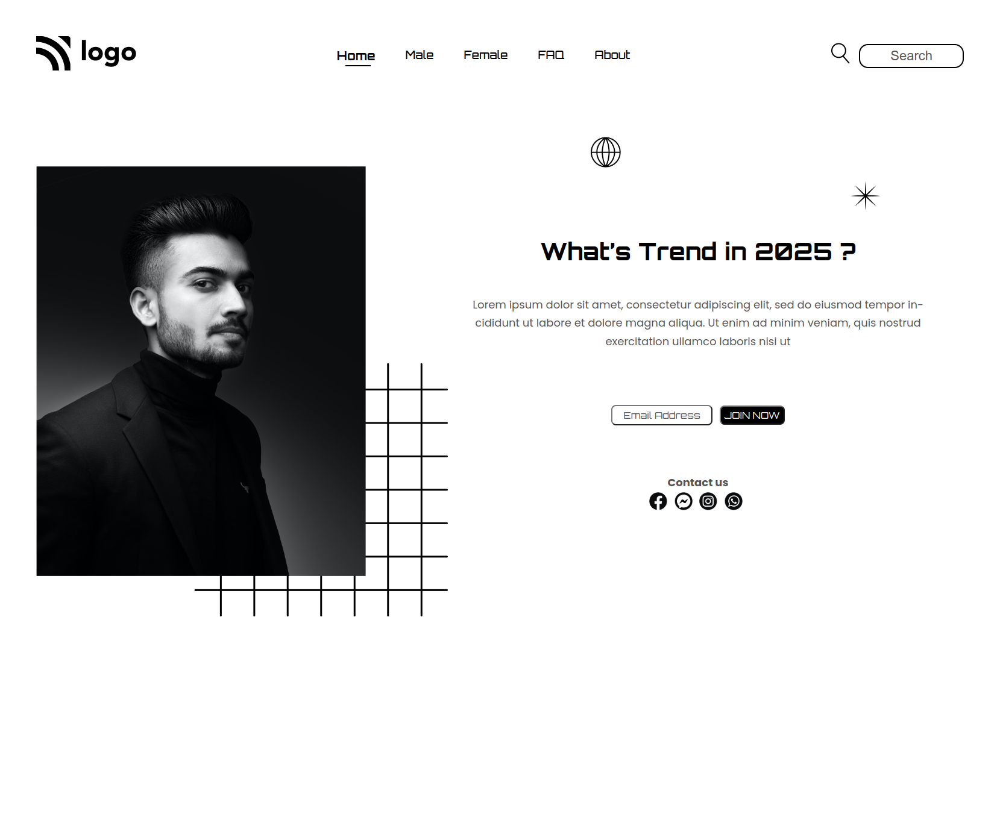

**Street Landing Page**

## 💻 **Tech Stack** :

  !

---

## **My Learnings** :

-   [x] z-index
-   [x] position
-   [x] icons

> This project took around **4.5 hours** to complete.

---

## 👉 

---

## **ScreenShot**

-   ### Desktop view

---

## **Feedback**

-   If you have any feedback, please reach out to me at
    **clevercode99@gmail.com**

## **Connect with me:** 

#### Show some ❤️ by Liking ⭐ To this Repository. Also Follow me on

  

### **Thank You...**
